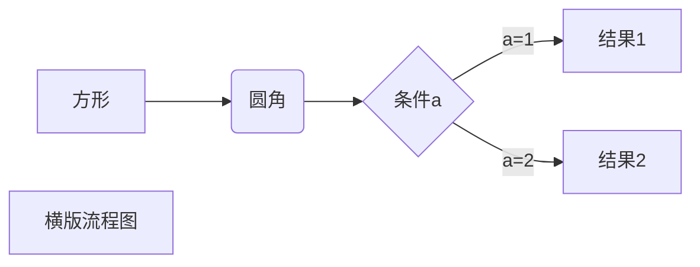
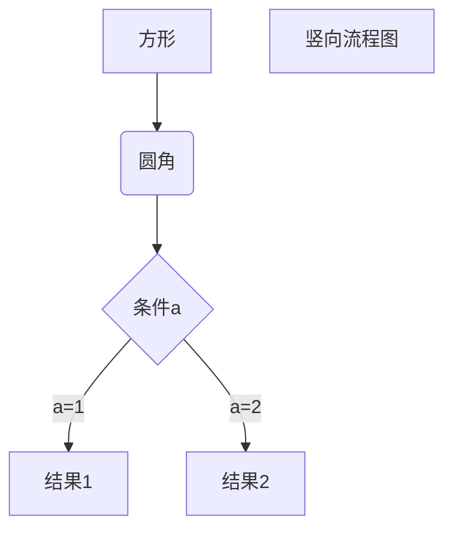

[toc]
## markdown的用法总结

#### 1. 标题
使用1~6个#就可以设置标题
我一般使用第2、4、6个

#### 2. 字体
使用**2个星号**就可以加粗强调

#### 3. 分割线
------------------

#### 4. 区块引用
> 最外层
> > 第一层嵌套
> > > 第二层嵌套

#### 5. 代码
```js
console.log()
```

#### 6. 链接名称
[哈哈哈这是百度吧](https://www.baidu.com)


#### 7. 流程图

-----------------


<br>
<br>
<br>

## Git
    9期录播课
关键在于 **版本控制** 和 **多人（团队）协作**

发展历程：
1.本地版本控制系统
2.集中化的版本控制系统
3.分布式版本控制系统

**35:00 之前都是铺垫和介绍，现在开始真正的讲**

Git是钱  Github是人民币或美元
一个是协议  一个是协议的实现
除了github还有码云等，不同平台

Git GUI是图形化工具  不建议使用
Git cmd跟原生的差不多  也不推荐使用
就使用 Git bash就好
安装完成后在任何文件右键都可以出现

**43:00 讲创建仓库   是否初始化等**
创建的仓库是个空的，可以理解成文件夹，空的
只是这个文件夹可以记录各个版本的信息，允许多人协作等

**44:50 开始讲git的本地配置  SSH协议**
如果用https会慢一些
所以讲SSH 公钥秘钥
ssh-keygen -t rsa

找到秘钥复制  github账号  头像-设置-SSH and GPG keys

暂存区的作用就两字：分类
把做完的那部分  先放在暂存区

log 是查看详细记录信息
reflog是查看记录

**1:09:00 讲status**

**1:16:00 开始讲跟github的互动    push**
git push origin master

**1:25:00 讲版本回退**
git reset --hard HEAD/ceb1746（版本号）
跳到不同版本
还可以用hard^ 或者~num 回退

**1:32:00讲到 git diff**

**1:35:00 开始讲分支**
先复习一下
git clone
git add file 
git commit -m msg
git push origin master
git log
git reflog
git diff
git reset

**1:37:30 讲分支**
分支的意义很大，它的意义就是多人开发

**1:49:00讲到**
git branch
git branch dev
git checkout dev

git checkout -b dev1

git push origin dev:dev

git merge dev合并分支

**1:59:30**
git push -d origin dev 
d是delete  删除

## 第二小节
开局就讲合并冲突  还有提到pull

**15:00 就开始问问题了**
push origin中origin是远端仓库的别名
可通过 git remote rename origin dev来重命名
甚至可以不写 默认master   
但是工作习惯  最好还是养成良好的习惯 

**17:00 就开始说setupVpn插件怎么装的事**
**27:00 说最后一节课  交代大家人生路漫漫且行且珍惜  有什么问题向老师反映不要去网上当键盘侠 这小节讲的跟Git本身关系不大了** 